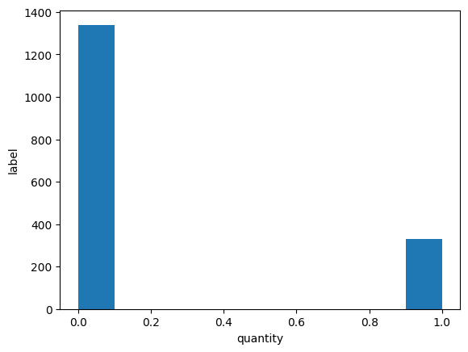
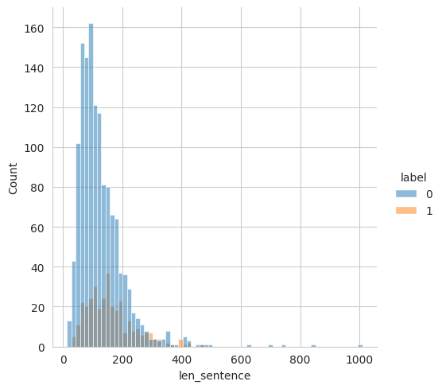
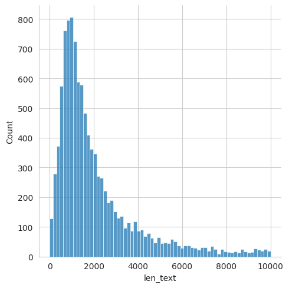
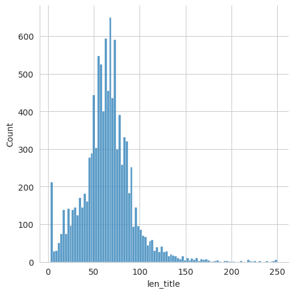

# News Delay Classification

This project uses a custom BERT model to classify news.

## Structure

- `prediction.csv` Contains predictions in column pred
- `data/`: Contains raw and processed data.
- `models/`: Custom BERT model definition.
- `notebooks/`: Jupyter notebooks for training and experimentation.
- `src/`: Source code for data processing, model training, evaluation, and utilities.
- `tests/`: Unit tests.
- `.gitignore`: Specifies files to be ignored by git.
- `requirements.txt`: Lists dependencies.
- `README.md`: Project overview and setup instructions.
- `inference.py`: Fit and inference script.

## Setup

1. Clone the repository:
   ```bash
   git clone git@github.com:PoulYak/NewsDelayClassification.git
   ```
2. Install dependencies

    ```bash
   pip install -r requirements.txt
   ```
3. Run the project:
   Follow instructions in `infer.py`. to train the model or look at `inference.py`.

## Описание задачи

Привет кандидат на вакансию!

**Основная задача** новостного мониторинга - обрабатывать входящий поток новостей,
находя в них интересные пользователям события. В задании предлагается построить модель
для выявления в новости информации о задержке ввода некоторого объекта в эксплуатацию.

Рекомендуем для начала выбрать какой-нибудь простой интерпретируемый бейзлайн, провести EDA,
поискать зависимости в данных. Возможно, в описываемой задаче заработает unsupervised-подход (но это не точно).

В задаче есть следующие входные данные:

- Обучающая выборка (train_data.csv)
- Новостной поток за несколько дней (test_data.csv)

**Формулировка задачи:**

- Обучить модель, которая будет искать в потоке новости с информацией о событии.
- Выбрать метрики, которые с вашей точки зрения будут наиболее релевантны для решаемой бизнес-задачи.
- Обосновать выбор метрик и модели.

**Формат результатов:**

- Файл с кодом и описанием алгоритма поиска релевантных новостей. Можно присылать в виде архива(zip формат) или постить
  на git. В любом случае, нужен readme файл, прочитав который, можно будет воспроизвести процесс обучения модели;
- Развёрнутое описание результатов, метрик, возможно интерпретация предсказаний модели (если модель интерпретируемая).
  Презентация результатов имеет тоже большой вес. К примеру, если получится построить относительно простую модель,
  которая будет выбивать чуть худшие метрики, чем более сложная модель, но при этом будет интерпретируемой/работать
  быстрее/потреблять меньше ресурсов/запускаться на CPU, возможно стоит остановить свой выбор на ней и развернуто
  описать как вы пришли к такому выбору (опять же, зависит от конкретных результатов, сильно гнаться за скоростью
  инференса не стоит);
- Файл test_data.csv с добавленным полем, содержащим вероятность принадлежности новости к положительному классу.
  Пожелания:
  Не забываем, что сейчас 2024 год с соответствующими технологиями.

## Метрики

Пока нету четкого понимания бизнес полезности решения и того как оно будет использоваться,
нельзя сказать на что следует больше обращать внимание Precision или Recall и стоит ли,
поэтому ключевыми метриками качества модели будем считать f1-score и roc_auc

## Исследование

1. Посчитаем кол-во классов и распеделение длин для label 0/1
   
   
2. Далее посмотрим на распределение длин в новостном потоке для title и text
   
   

### Предобработка данных

- Оставляем только текст (избавляемся от лишних символов)
- Стемминг

### Подход 1

- Делаем TF-IDF
- Обучаем логистическую регрессию
- ROC AUC 0.9617, F1_score 0.8849

### Подход 2

- Делаем TF-IDF
- Обучаем CatBoost
- ROC AUC 0.965, F1_score 0.8998

### Подход 3

- Finetuning of Bert (Замораживаем все слои кроме последнего)
- Генерируем больше примеров c label 1 с помощью chatGPT
- Изучаем residuals модели (некоторые обучающие данные убираем из выборки, на основе некоторых ещё генерируем примеров)
- Поменяем tokenizer и pretrained bert на предобученный на русском контексте (RuBert)
- ROC AUC 0.9877, F1_score 0.9452

### Test (prediction generate)

Разбиваем текст на чанки и берем максимальное из предсказаний
для выявления в новости информации о задержке ввода некоторого объекта в эксплуатацию 
формируем prediction.csv
